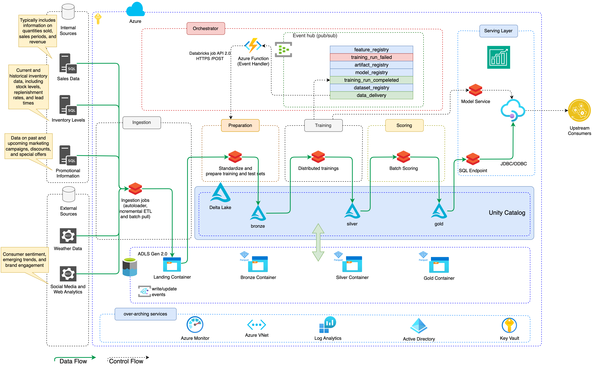
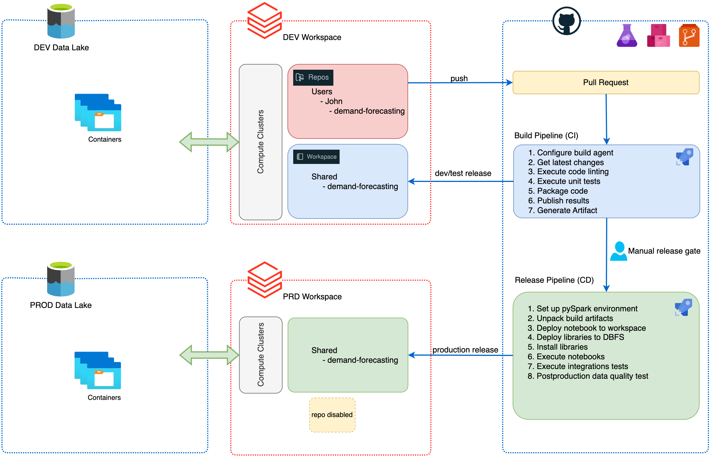
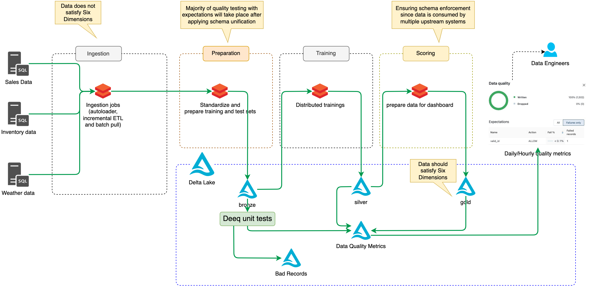

# Fine-rained Demand Forecasting @ Scale

This repository contains the codebase and architectural guidance for implementing Many-Models Machine Learning (ML) at scale, specifically tailored for demand forecasting applications. The architecture leverages Apache Spark, deployed on Azure Databricks, to facilitate extensive and complex data transformations required by certain demand forecasting solutions. Databricks offers a robust environment for handling the significant data processing demands of this application.

## Overall Architecture

## Key Challenges Addressed:

### 1. Model Catalog Management

- **Challenge**: It is complex to maintain a comprehensive catalog of diverse ML models, complicating the tracking and management of each model's performance and lifecycle.

### 2. Data Integration Complexity

- **Challenge**: Achieving high accuracy in demand forecasting requires the integration of various data sources, including sales data, inventory levels, promotional activities, and external factors like weather. Without a solid data platform architecture, this integration process becomes cumbersome, impacting data quality and accessibility.

### 3. Granularity Versus Aggregate Patterns

- **Challenge**: Aggregate demand trends may not capture local or specific variations accurately, necessitating fine-grained analysis to derive actionable insights. This adds complexity and unpredictability to the forecasting efforts.

### 4. Continuous Model Retraining

- **Challenge**: To counteract seasonal variations and shifts in consumer behavior, demand forecasting models need continuous retraining. A scalable architecture is essential to support this, ensuring ongoing model accuracy and relevance.

### 5. Model Complexity and Scalability

- **Challenge**: Moving towards detailed demand forecasting increases the number and complexity of required models. This rise in complexity demands scalable solutions to meet the computational needs within acceptable service windows.

### 6. Adapting to Many-Model Approaches

- **Challenge**: A many-model approach to demand forecasting introduces significant challenges in model delivery and management. Scalable MLOps practices are crucial for efficiently managing a large portfolio of models, each customized to specific business aspects such as store performance, geographic location, or product categories.

## Architecture Overview

The provided code and instructions prepare users to deploy a scalable demand forecasting solution using Apache Spark on Azure Databricks. This setup is designed to address the enumerated challenges by providing a comprehensive, flexible, and scalable framework for integrating diverse data sources, managing a broad catalog of ML models, and facilitating continuous model retraining and deployment.

## Getting Started

To begin using this architecture for your demand forecasting needs, please follow the setup and deployment instructions provided in the subsequent sections. Ensure that your Azure Databricks environment is configured according to the prerequisites outlined, and familiarize yourself with Apache Spark's capabilities to maximize the effectiveness of your implementation.

## CI/CD for Data Products (DataOps)

1. Integrates DevOps principles into data management, focusing on enhancing data quality, speed, and reliability.
1. Aims to maintain consistent data environments across development and production phases, utilizing a usable copy of data in the development data lake that is representative enough for developing visualizations and ML models.
1. Development phase involves creating jobs in a development environment, triggering CI processes through feature branch pushes and pull requests, which include code linting, unit testing, packaging, and artifact generation.
1. Continuous Delivery (CD) phase emphasizes data contract testing to ensure source data changes do not adversely affect consumers, involving PySpark environment setup, deployment of notebooks and libraries, and conducting integration tests and post-production data quality assessments.
1. Lakehouse Monitoring as an integrated platform service offers ready-to-use quality metrics, with capabilities for custom metric definition, automatic alerting on data quality issues, and integration into the data chain for root cause analysis. Data transformation and cleaning primarily occur at the Silver level, which serves as the single source of truth, whereas the Gold layer provides consumers with a refined view for reporting and dashboarding.

## Data Quality

1. Continuous integration and delivery processes focus on ensuring high-quality, accurate, and reliable data availability for downstream consumers.
1. Utilizes an automated dashboard for visualizing quality metrics and complex statistics, enabling immediate access to data health insights.
1. Offers customizable metrics linked to business logic, allowing users to be alerted to data quality issues for proactive management.
1. Alerts are integrated with the Unity Catalog data chain, facilitating easier root cause analysis and issue resolution.
1. Data is initially ingested from various sources into the Bronze layer, kept largely unprocessed for flexibility; data quality processes like deduplication and schema enforcement mainly occur at the Silver layer, establishing it as the source of truth, while the Gold layer presents an aggregated, refined data view for end-use applications.

## Data Sources

In demand forecasting, the accuracy and reliability of predictions significantly depend on the variety and quality of data sources utilized. Various internal and external data sources can provide critical insights for making accurate forecasts. Here are some of the key sources of data commonly used in demand forecasting:

- Sales Data: Historical sales data is the cornerstone of demand forecasting. It includes information on quantities sold, sales periods, and revenue, which helps in identifying patterns, trends, and seasonality in product demand.

- Inventory Levels: Current and historical inventory data, including stock levels, replenishment rates, and lead times, are essential for understanding the supply side constraints and planning for future demand.

- Promotional Information: Data on past and upcoming marketing campaigns, discounts, and special offers are crucial for forecasting demand spikes or dips associated with promotional activities.

- External Economic Indicators: Economic indicators such as GDP growth rates, unemployment rates, consumer spending levels, and industry-specific economic reports can influence demand forecasting, especially for businesses sensitive to economic cycles.

- Weather Data: Weather conditions have a profound impact on the demand for various products. For instance, the demand for air conditioners rises in hot weather, while colder weather increases the demand for heaters.

- Social Media and Web Analytics: Data from social media and web analytics can provide insights into consumer sentiment, emerging trends, and brand engagement, which can influence demand.

- Competitor Activity: Information on competitors’ actions, such as new product launches, pricing changes, and marketing campaigns, can also affect demand for your products.

- Demographic Information: Population demographics, including age, gender, income levels, and geographic location, help in segmenting the market and forecasting demand more accurately for different segments.

- Event Information: Special events (e.g., sports events, concerts, festivals) can lead to temporary changes in demand patterns, which need to be accounted for in the forecasting process.

- Regulatory Changes: Changes in laws and regulations can impact demand forecasting. For instance, new environmental regulations can increase the demand for green products.

Integrating these diverse data sources into a cohesive demand forecasting model involves sophisticated data processing and analysis techniques. The use of scalable MLOps practices allows for the efficient handling and processing of this data, enabling the deployment of multiple specialized models tailored to specific attributes of the business, such as location or product category. This many-model approach enhances the precision of demand forecasts by accounting for the unique factors influencing demand in different segments of the market.
